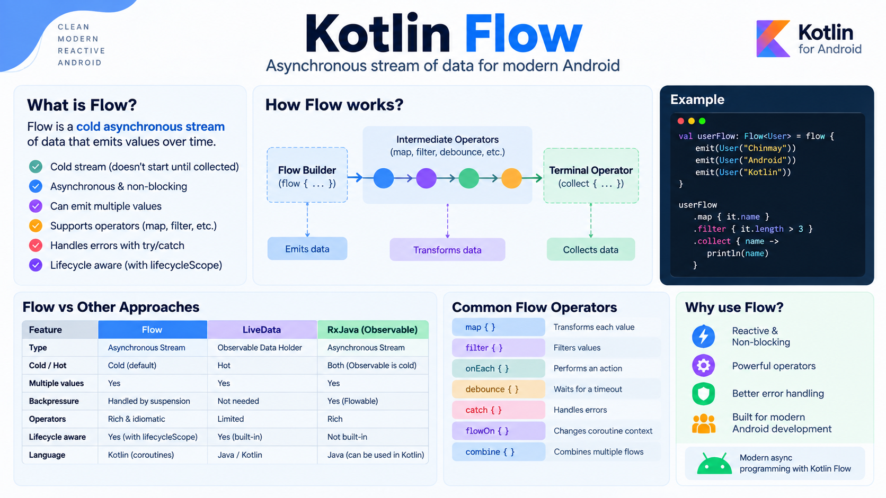
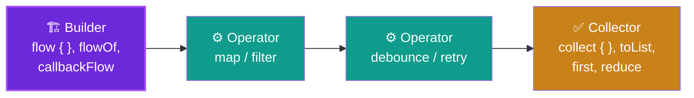
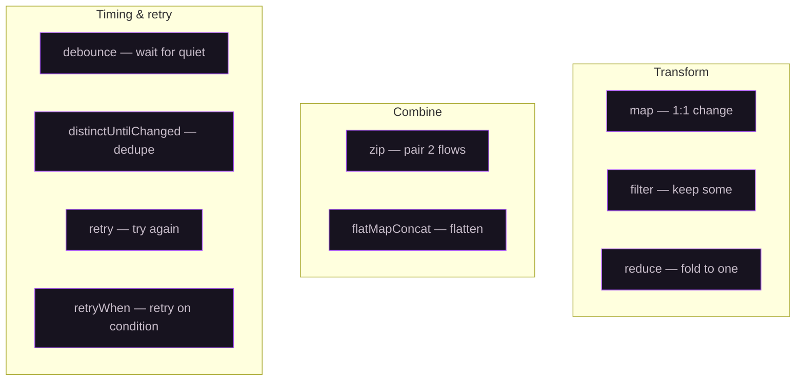

<div align="center">

# 🌊 Learn Kotlin Flow

### Master Kotlin Flow through real Android examples — operators, network, Room, search, retry, and error handling.

<p>
  <a href="https://github.com/chinmay-tayade/Learn-Kotlin-Flow/blob/main/LICENSE"></a>
  <a href="https://github.com/chinmay-tayade/Learn-Kotlin-Flow/stargazers"></a>
  <a href="https://kotlinlang.org"></a>
  <a href="https://developer.android.com"></a>
</p>



</div>

---

## 🎯 About this project

**Kotlin Flow** is a coroutine-based library for building **reactive streams** — sequences of values emitted over time. If coroutines are *how* you run concurrent work, Flow is *how* you model **streams** of data: a database that updates live, a network response, a search box that emits as you type.

This project teaches Flow the way you'll actually use it in an Android app, one runnable example at a time.

---

## 🧠 The Flow pipeline, visualised

Every Flow has three parts: a **builder** produces values, **operators** transform them, and a **collector** consumes them.



> **Nothing happens until you collect.** A Flow is **cold** — the builder only runs when a collector subscribes. Contrast with `StateFlow`/`SharedFlow`, which are **hot**: they emit regardless of collectors.

---

## 📚 Table of contents

- [Concepts to learn first](#-concepts-to-learn-first)
- [What you'll learn here](#-what-youll-learn-here)
- [Example index](#-example-index)
- [Operator cheat-sheet](#-operator-cheat-sheet)
- [Project structure](#-project-structure)
- [How to build & run](#-how-to-build--run)

---

## 🎓 Concepts to learn first

| Concept | What it is | Read more |
|---|---|---|
| **Flow builder** | `flow { }`, `flowOf`, `asFlow` — how you create a stream | [docs](https://kotlinlang.org/docs/flow.html#flows) |
| **Terminal operators** | `collect`, `toList`, `first`, `reduce` — what ends the stream | [docs](https://kotlinlang.org/docs/flow.html#flow-is-cold) |
| **Cold vs Hot flow** | Cold runs per-collector; hot runs independent of collectors | [docs](https://kotlinlang.org/docs/flow.html) |
| **`StateFlow` / `SharedFlow`** | Hot flows for UI state and shared events | [docs](https://developer.android.com/kotlin/flow/stateflow-and-sharedflow) |
| **`callbackFlow`** | Bridge a callback API into a Flow | [docs](https://kotlinlang.org/api/kotlinx.coroutines/kotlinx-coroutines-core/kotlinx.coroutines.flow/callback-flow.html) |
| **Exception handling** | `catch`, `emitAll`, try/catch | [docs](https://kotlinlang.org/docs/flow.html#flow-exceptions) |

---

## 🧭 What you'll learn here

- ✅ Use Flow in an Android project
- ✅ Run tasks in series and parallel with Flow
- ✅ Make single, series, and **parallel network calls** (with `zip`)
- ✅ Apply operators: `filter`, `map`, `reduce`, `flatMapConcat`, `zip`
- ✅ Handle errors with `catch` and `emitAll`
- ✅ Use `onCompletion`
- ✅ Retry with `retry`, `retryWhen`, and **exponential backoff**
- ✅ Use Flow with Retrofit and Room
- ✅ Build **instant search** (`debounce` + `filter` + `distinctUntilChanged` + `flatMapLatest`)
- ✅ Unit-test a Flow-based ViewModel

---

## 🗂️ Example index

| # | Example | What it teaches | Code |
|---|---|---|---|
| 1 | **Single Network Call** | Simplest Flow network call | [Activity](app/src/main/java/com/chinmaytayade/learn/kotlin/flow/ui/retrofit/single/SingleNetworkCallActivity.kt) · [ViewModel](app/src/main/java/com/chinmaytayade/learn/kotlin/flow/ui/retrofit/single/SingleNetworkCallViewModel.kt) |
| 2 | **Series Network Calls** | Dependent calls | [Activity](app/src/main/java/com/chinmaytayade/learn/kotlin/flow/ui/retrofit/series/SeriesNetworkCallsActivity.kt) · [ViewModel](app/src/main/java/com/chinmaytayade/learn/kotlin/flow/ui/retrofit/series/SeriesNetworkCallsViewModel.kt) |
| 3 | **Parallel Network Calls** | Independent calls via `zip` | [Activity](app/src/main/java/com/chinmaytayade/learn/kotlin/flow/ui/retrofit/parallel/ParallelNetworkCallsActivity.kt) · [ViewModel](app/src/main/java/com/chinmaytayade/learn/kotlin/flow/ui/retrofit/parallel/ParallelNetworkCallsViewModel.kt) |
| 4 | **Room DB Operation** | Flow with Room | [Activity](app/src/main/java/com/chinmaytayade/learn/kotlin/flow/ui/room/RoomDBActivity.kt) · [ViewModel](app/src/main/java/com/chinmaytayade/learn/kotlin/flow/ui/room/RoomDBViewModel.kt) |
| 5 | **Long Running Task** | Background task | [Activity](app/src/main/java/com/chinmaytayade/learn/kotlin/flow/ui/task/onetask/LongRunningTaskActivity.kt) · [ViewModel](app/src/main/java/com/chinmaytayade/learn/kotlin/flow/ui/task/onetask/LongRunningTaskViewModel.kt) |
| 6 | **Two Long Running Tasks** | Parallel tasks | [Activity](app/src/main/java/com/chinmaytayade/learn/kotlin/flow/ui/task/twotasks/TwoLongRunningTasksActivity.kt) · [ViewModel](app/src/main/java/com/chinmaytayade/learn/kotlin/flow/ui/task/twotasks/TwoLongRunningTasksViewModel.kt) |
| 7 | **Catch Error Handling** | `catch` operator | [Activity](app/src/main/java/com/chinmaytayade/learn/kotlin/flow/ui/errorhandling/catch/CatchActivity.kt) · [ViewModel](app/src/main/java/com/chinmaytayade/learn/kotlin/flow/ui/errorhandling/catch/CatchViewModel.kt) |
| 8 | **EmitAll Error Handling** | Recover with a fallback flow | [Activity](app/src/main/java/com/chinmaytayade/learn/kotlin/flow/ui/errorhandling/emitall/EmitAllActivity.kt) · [ViewModel](app/src/main/java/com/chinmaytayade/learn/kotlin/flow/ui/errorhandling/emitall/EmitAllViewModel.kt) |
| 9 | **Completion** | `onCompletion` | [Activity](app/src/main/java/com/chinmaytayade/learn/kotlin/flow/ui/completion/CompletionActivity.kt) · [ViewModel](app/src/main/java/com/chinmaytayade/learn/kotlin/flow/ui/completion/CompletionViewModel.kt) |
| 10 | **Reduce** | `reduce` operator | [Activity](app/src/main/java/com/chinmaytayade/learn/kotlin/flow/ui/reduce/ReduceActivity.kt) · [ViewModel](app/src/main/java/com/chinmaytayade/learn/kotlin/flow/ui/reduce/ReduceViewModel.kt) |
| 11 | **Map** | `map` operator | [Activity](app/src/main/java/com/chinmaytayade/learn/kotlin/flow/ui/map/MapActivity.kt) · [ViewModel](app/src/main/java/com/chinmaytayade/learn/kotlin/flow/ui/map/MapViewModel.kt) |
| 12 | **Filter** | `filter` operator | [Activity](app/src/main/java/com/chinmaytayade/learn/kotlin/flow/ui/filter/FilterActivity.kt) · [ViewModel](app/src/main/java/com/chinmaytayade/learn/kotlin/flow/ui/filter/FilterViewModel.kt) |
| 13 | **Search Feature** | Instant search: `debounce` + `filter` + `distinctUntilChanged` + `flatMapLatest` | [Activity](app/src/main/java/com/chinmaytayade/learn/kotlin/flow/ui/search/SearchActivity.kt) |
| 14 | **Retry** | `retry` operator | [Activity](app/src/main/java/com/chinmaytayade/learn/kotlin/flow/ui/retry/RetryActivity.kt) · [ViewModel](app/src/main/java/com/chinmaytayade/learn/kotlin/flow/ui/retry/RetryViewModel.kt) |
| 15 | **RetryWhen** | `retryWhen` for conditional retry | [Activity](app/src/main/java/com/chinmaytayade/learn/kotlin/flow/ui/retrywhen/RetryWhenActivity.kt) · [ViewModel](app/src/main/java/com/chinmaytayade/learn/kotlin/flow/ui/retrywhen/RetryWhenViewModel.kt) |
| 16 | **Retry with Exponential Backoff** | Backing off between retries | [Activity](app/src/main/java/com/chinmaytayade/learn/kotlin/flow/ui/retryexponentialbackoff/RetryExponentialBackoffActivity.kt) · [Model](app/src/main/java/com/chinmaytayade/learn/kotlin/flow/ui/retryexponentialbackoff/RetryExponentialBackoffModel.kt) |
| 17 | **Unit Test** | Test a Flow-based ViewModel | [Test](app/src/test/java/com/chinmaytayade/learn/kotlin/flow/ui/retrofit/single/SingleNetworkCallViewModelTest.kt) |

---

## ⚙️ Operator cheat-sheet



| Operator | Purpose |
|---|---|
| `map` | Transform each emitted value |
| `filter` | Emit only values that match a predicate |
| `reduce` | Fold the whole stream into a single value |
| `zip` | Combine two flows pairwise (great for parallel calls) |
| `flatMapConcat` / `flatMapLatest` | Flatten a flow-of-flows (sequential / only-latest) |
| `debounce` | Emit only after a pause — ideal for search input |
| `distinctUntilChanged` | Skip consecutive duplicates |
| `retry` / `retryWhen` | Re-subscribe on failure, with optional backoff |
| `onCompletion` | Run code when the flow completes or fails |

---

## 🏗️ Project structure

```
app/src/main/java/com/chinmaytayade/learn/kotlin/flow/
├── data/
│   ├── api/            # Retrofit: ApiHelper, ApiService, RetrofitBuilder
│   └── local/          # Room: AppDatabase, UserDao, DatabaseHelper
├── ui/
│   ├── base/           # UiState, adapters, ViewModelFactory
│   ├── retrofit/       # single / series / parallel network calls
│   ├── room/           # Room DB example
│   ├── task/           # one / two long-running tasks
│   ├── errorhandling/  # catch / emitall
│   ├── search/         # instant search with debounce
│   ├── retry/          # retry / retrywhen / exponential backoff
│   └── operators/      # map / filter / reduce / completion / flowOn
├── utils/              # DispatcherProvider, Extensions
└── MainActivity.kt     # Entry point & example menu
```

---

## 🛠️ How to build & run

```bash
git clone https://github.com/chinmay-tayade/Learn-Kotlin-Flow.git
cd Learn-Kotlin-Flow
./gradlew assembleDebug
```

> Requires **JDK 17+** and **Android SDK**. Each example is reachable from `MainActivity`.

---

## 📜 License

```
Licensed under the Apache License, Version 2.0 (the "License");
you may not use this file except in compliance with the License.
You may obtain a copy of the License at

    http://www.apache.org/licenses/LICENSE-2.0

Unless required by applicable law or agreed to in writing, software
distributed under the License is distributed on an "AS IS" BASIS,
WITHOUT WARRANTIES OR CONDITIONS OF ANY KIND, either express or implied.
See the License for the specific language governing permissions and
limitations under the License.
```

---

## 🤝 Contributing

Have a clearer Flow example or a missing operator? Pull requests welcome.

> 💚 If this helped you, drop a ⭐ so other Android engineers find it.
